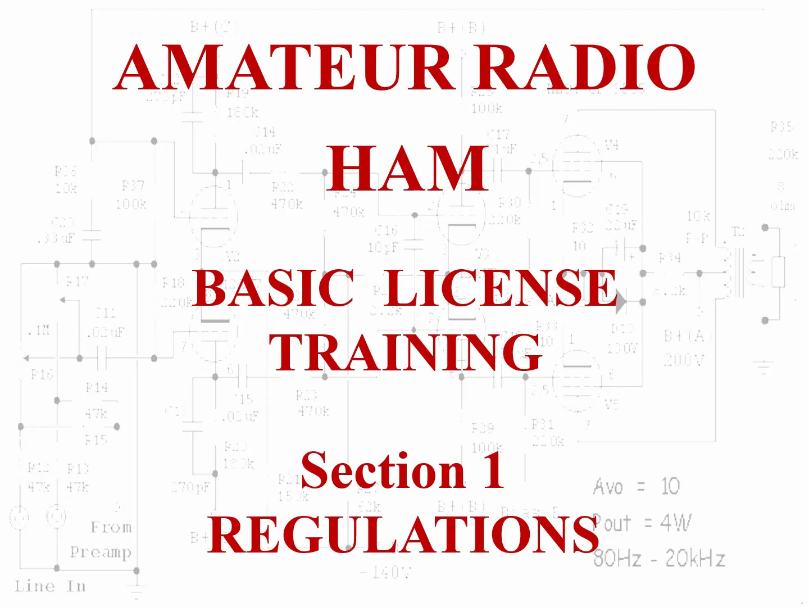

# Vidnote

This project provides a containerized service that converts a video lecture into a formatted Markdown document, complete with correlated slide screenshots. It uses OpenAI's Whisper for transcription and PySceneDetect for extracting slide images.

[](http://files.clares.ca/video79386405-A6D2-4BE7-BC63-157EC1EF9191.mp4)

## Prerequisites

- **Podman**: The service runs inside a Podman container. Ensure Podman is installed and initialized (`podman machine init`, `podman machine start`).

## Usage

The easiest way to run the converter is using the provided wrapper script:

```bash
./run_processor.sh <path_to_video> <output_folder>
```

### Example

```bash
./run_processor.sh data/input/lecture.mp4 data/output
```

This command will:
1.  Build the `vidnote` container image (if it doesn't exist).
2.  Mount the necessary directories.
3.  Process the video.
4.  Output the results to `data/output`.

## Example Output

[View Example Output](example/transcript.md)

## Output Structure

The output folder will contain:

-   **`transcript.md`**: The full transcript of the video, with slide images inserted at the appropriate timestamps.
-   **`images/`**: A subdirectory containing the extracted slide screenshots (e.g., `scene_001.jpg`).

## Configuration & Parameters

The underlying Python application (`main.py`) accepts the following arguments. You can modify `run_processor.sh` to pass these if needed.

| Argument | Description | Default |
| :--- | :--- | :--- |
| `--input_video` | Path to the video file inside the container. | (Required) |
| `--output_dir` | Path to write results inside the container. | (Required) |
| `--temp_dir` | Path for intermediate files (audio extraction). | (Required) |
| `--threshold` | Scene detection threshold. Lower values are more sensitive. | `15.0` |

### Changing the Threshold

The `--threshold` parameter controls the sensitivity of the scene detection algorithm (PySceneDetect's `ContentDetector`). It represents the minimum change in average pixel intensity between frames required to trigger a scene cut.

-   **Default (15.0)**: Good for most slide presentations where transitions are distinct but might be subtle (e.g., just text changing).
-   **Lower values (e.g., 5.0 - 10.0)**: **More Sensitive**. Use this if the tool is missing slide changes (e.g., only a small bullet point appears). Warning: May detect false positives like mouse movements or small animations.
-   **Higher values (e.g., 30.0 - 50.0)**: **Less Sensitive**. Use this if the tool is detecting too many "scenes" that aren't real slides (e.g., webcam video of the speaker moving slightly).

To change the threshold via the wrapper script, append the argument to the `podman run` command in `run_processor.sh`:

```bash
  vidnote \
  --input_video "/data/input/$VIDEO_FILENAME" \
  --output_dir "/data/output" \
  --temp_dir "/data/tmp" \
  --threshold 10.0  # Example: More sensitive for subtle changes
```

## Project Structure

-   `data/input/`: Place your input video files here.
-   `data/output/`: Generated transcripts and images will appear here.
-   `data/tmp/`: Intermediate files (like extracted audio) are stored here.
-   `Dockerfile`: Defines the environment (Python 3.11, FFmpeg, OpenCV).
-   `main.py`: Core application logic.
-   `run_processor.sh`: Helper script to handle volume mounting and execution.
