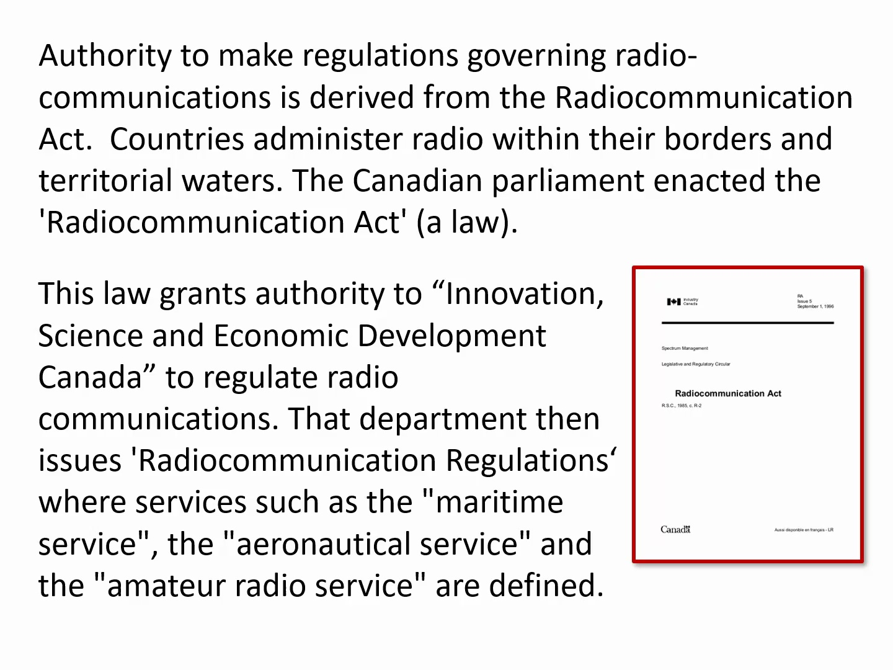
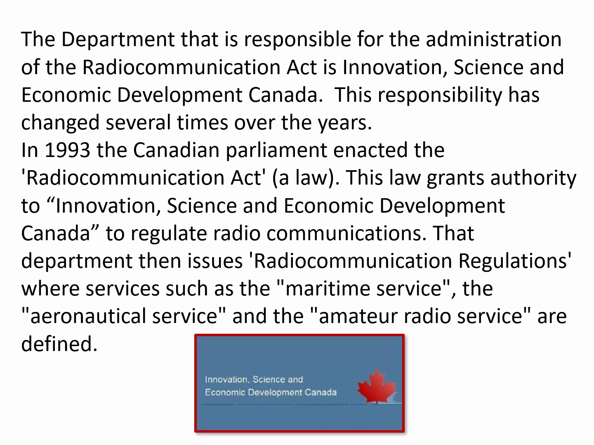
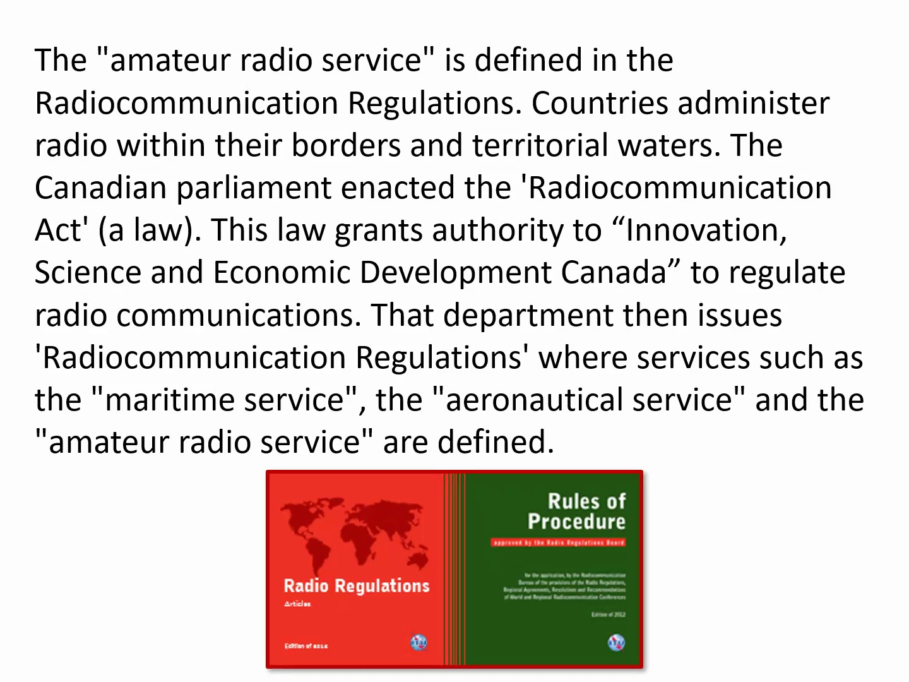

# Video Transcript

Welcome to amateur radio or ham radio basic license training. The actual name for amateur radio is amateur radio. Ham is a slang word that has been attached to amateur radio. The reason it's called amateur radio is because we cannot charge for services rendered for using the equipment, passing information and so on. But we are not amateurs. We are professionals and trained in the use of radios. As you go through this training, you will receive enough information to be able to pass the basic exam and receive your call sign. There's not enough information here by any means to make you a professional radio operator. You will have to continue to study and use the equipment to become professional at it. So this first section is on regulations. 

Authority to make regulations governing radio communications is derived from the Radio Communications Act. Country's administrative radio within their borders and territorial waters. The Canadian Parliament enacted the Radio Communications Act, which is a law. This law grants authority to Innovation Science and Economic Development Canada to regulate radio communications. That department then issues radio communications regulations, where services such as maritime service, the aeronautical service and the amateur radio service are defined. 

The department that is responsible for the administration of the Radio Communication Act is Innovation Science and Economic Development Canada. This responsibility has changed several times over the years. In 1993, the Canadian Parliament enacted the Radio Communication Act, a law. This law grants authority to Innovation Science and Economic Development Canada to regulate radio communications. That department then issues radio communication regulations, where services such as maritime service, aeronautical service and amateur radio service are defined. 

The amateur radio service is defined in the Radio Communications Regulations. Country's administrative radio within their borders and territorial waters, the Canadian Parliament enacted the Radio Communication Act, or the law. This law grants authority to Innovation Science and Economic Development Canada to regulate radio communications. That department then issues radio communication regulations, where services such as maritime service, the aeronautical service and the amateur radio service are defined. Now we're looking at two different things. Don't confuse them. There is a law which is put into place by the Parliament. Then there is regulations which are set up and controlled by Innovation Science and Economic Development Canada. 